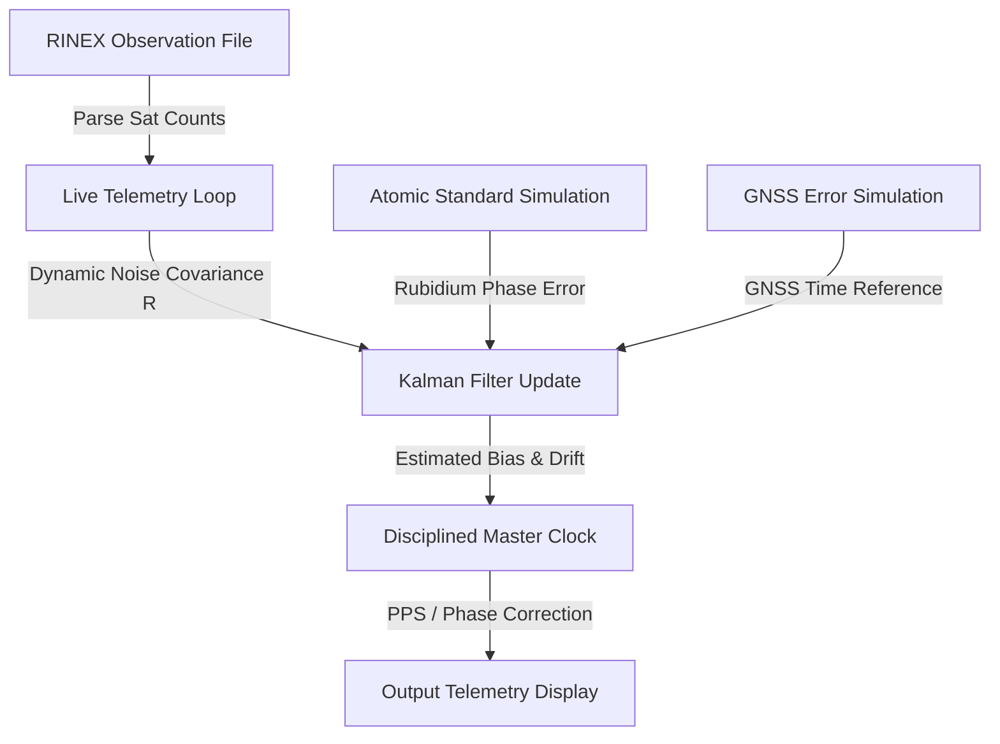

# Space-Time Synchronization: GNSSDO Simulation & Telemetry

A high-fidelity hardware-in-the-loop (HIL) emulation and diagnostic dashboard for Global Navigation Satellite System Disciplined Oscillators (GNSSDO). This tool simulates the synchronization of a local atomic standard (Rubidium oscillator) with GPS/Galileo/GLONASS reference time, using a two-state Kalman filter driven by real-world satellite observation data (RINEX).

The dashboard is built entirely with Python, Streamlit, NumPy, FilterPy, and Matplotlib.

---

## Key Features

### 1. Real-Time Telemetry & Diagnostics
- **Disciplined Master Clock Phase Error**: Displays the phase offset of the disciplined system vs. raw GNSS and free-running Rubidium time series.
- **Kalman Filter State Tracking**: Visualizes estimated clock bias and state variances (3$\sigma$ confidence bounds).
- **Frequency Drift Estimation**: Charts estimated frequency drift rate in real-time.
- **Measurement Innovations**: Tracks the filter's performance by plotting the innovation sequence ($z - H\hat{x}$).

### 2. Live HIL Playback Emulation (Telemetry Panel)
- **Clock HUD**: Displays UTC GPSDO master clock time with sub-microsecond precision.
- **Time Sources Offset HUD**: Visualizes true time, GNSS time, Rubidium time, and disciplined time offsets.
- **Interactive Timeline Seek**: Features a timeline scrubber slider that allows you to click or drag to jump to any epoch in the 24-hour observation dataset instantly, resetting state history dynamically.
- **Dataset Progress HUD**: Tracks the current epoch index, percentage, and time remaining in the dataset.
- **PPS Hardware Emulation**: Compares expected 1 Pulse Per Second (PPS) hardware pulses against received pulses to calculate live synchronization offsets.
- **Holdover Prediction**: Predicts future 3$\sigma$ clock errors (1 minute, 10 minutes, and 1 hour) if GNSS lock is lost at the current epoch.
- **Smooth Animations**: Performance optimized using **Streamlit Fragments** (`@st.fragment`) to restrict animation reruns to the telemetry tab, eliminating screen flashing and full-page reloads.

### 3. Signal Source Characterization
- **Rubidium Standard Model**: Simulates phase error components including White Frequency Modulation (FM), Flicker FM, Random Walk FM, aging/frequency drift, and white measurement noise.
- **GNSS Delay Model**: Simulates satellite clock error, tropospheric/ionospheric propagation delays (using a Gauss-Markov correlated noise process), and receiver measurement noise.

### 4. Kalman Filter Tuning Sweeps
- Real-time sliders to adjust process noise covariance ($Q_{bias}$, $Q_{drift}$) and measurement noise covariance ($R$).
- Compares performance metrics (Standard deviation, Peak Outage Error, Final Error) across custom filter configurations.

### 5. Constellation Analysis (RINEX Integration)
- Parses and visualizes visible satellite counts (GPS, Galileo, GLONASS, SBAS) from real-world station files.
- Automatically adjusts the Kalman filter's operating modes based on satellite visibility:
  - **TRACKING Mode** ($\ge 15$ satellites): Dynamic covariance scaling based on satellite count (e.g. $R = (30\text{ ns})^2$ for $>30$ satellites).
  - **DEGRADED Mode** ($8 \le \text{sats} < 15$): Operates with high measurement noise ($R = (100\text{ ns})^2$).
  - **HOLDOVER Mode** ($< 8$ satellites): Skips measurement updates and propagates the clock state purely using prediction equations.

### 6. Allan Deviation (ADEV) Analysis
- Computes and charts the Allan deviation ($\sigma_y(\tau)$) for the Rubidium standard, raw GNSS, and the disciplined clock to characterize short-term and long-term stability.

---

## System Architecture



### Physical Models
- **Rubidium Noise Slopes**: Set according to ISRO IRNSS-class atomic clock standards:
  - White Frequency Noise ($h_0 = 2 \times 10^{-19}$)
  - Flicker Frequency Noise ($h_{-1} = 7 \times 10^{-23}$)
  - Random Walk Frequency Noise ($h_{-2} = 2 \times 10^{-30}$)
- **Gauss-Markov Propagation**: Simulates atmospheric correlation times ($\tau = 3600\text{ s}$) for realistic GNSS delays during atmospheric disturbances.

---

## Getting Started

### Prerequisites
- Python 3.10+
- virtualenv (optional but recommended)

### Installation

1. Clone the repository:
   ```bash
   git clone https://github.com/Vinodh-SpaceTS/Space_Time.git
   cd Space_Time
   ```

2. Create and activate a virtual environment:
   ```bash
   python -m venv .venv
   # On Windows:
   .venv\Scripts\activate
   # On Unix/macOS:
   source .venv/bin/activate
   ```

3. Install dependencies:
   ```bash
   pip install -r requirements.txt
   # Or using uv:
   uv pip install -r pyproject.toml
   ```

4. Run the Streamlit application:
   ```bash
   streamlit run app.py
   ```

---

## File Structure

- [app.py](file:///d:/CLOCK_SIM/app.py): Main dashboard application layout, telemetry components, styles, and control loops.
- [models/clock_model.py](file:///d:/CLOCK_SIM/models/clock_model.py): Simulation of Rubidium clock phase errors.
- [models/gnss_time_model.py](file:///d:/CLOCK_SIM/models/gnss_time_model.py): GNSS time signal errors, atmospheric propagation delays, and measurement noise.
- [models/kalman_filter.py](file:///d:/CLOCK_SIM/models/kalman_filter.py): 2-state Kalman filter implementation using FilterPy.
- [analysis/gnss_analysis.py](file:///d:/CLOCK_SIM/analysis/gnss_analysis.py): RINEX observation parser and satellite count generator.
- [analysis/allan_deviation.py](file:///d:/CLOCK_SIM/analysis/allan_deviation.py): Calculations for Allan Deviation and stability analysis.
- [config.py](file:///d:/CLOCK_SIM/config.py): Global configuration options, paths, and default parameters.
- [data/](file:///d:/CLOCK_SIM/data/): Folder containing RINEX observation files (e.g. `ab041000.25o`).

---

## GNSS Timing Validation Dataset

The `AB04` RINEX file is useful for constellation replay, but it is not enough to prove GNSSDO timing accuracy because it has no independent clock-truth channel.

For actual timing validation, use the `ALGO` paired dataset:

- Observation file: `GNSS_DATA/ALGO00CAN_R_20251000000_01D_30S_MO.crx.gz`
- Clock truth file: `GNSS_DATA/ESA0OPSFIN_20251000000_01D_30S_CLK.CLK.gz`
- Extracted truth CSV: `data/algo_receiver_clock_truth_2025100.csv`
- Station: `ALGO`
- Date: `2025-04-10`
- Truth samples: `2,880` epochs at `30 s`
- Truth field: `receiver_clock_offset_ns`

To check the GNSSDO, align your output by `epoch_utc` and compare its GNSS or disciplined master-clock time error against `receiver_clock_offset_ns`.

---

## License

This project is licensed under the MIT License. See the LICENSE file for details.
