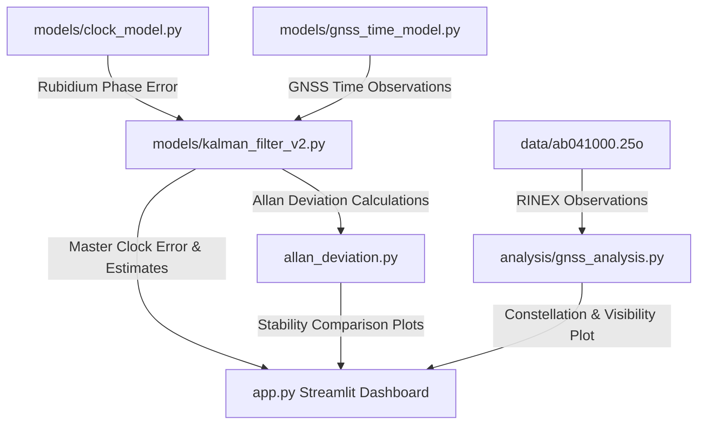

# Comprehensive Project Explanation: GNSSDO Clock Simulation

This document provides a full, detailed explanation of what is happening under the hood in the `CLOCK_SIM` project.

---

## 1. Executive Summary

This project is a high-fidelity simulator for a **GNSS-Disciplined Oscillator (GNSSDO)**, also known as a **Disciplined Master Clock**. 

High-precision timing systems (like those used in telecom networks, power grids, and data centers) require extreme synchronization accuracy. They usually face a trade-off:
- **Atomic Standards (e.g., Rubidium clocks):** Extremely stable in the short term, but drift over the long term due to physical aging.
- **GNSS Receivers (e.g., GPS/Galileo):** Highly accurate over the long term (no drift), but noisy and jittery in the short term due to atmospheric delay and measurement noise.

A **GNSSDO** combines both: it uses a **Kalman Filter** to measure the error between the Rubidium clock and the GNSS reference, steering (disciplining) the Rubidium clock to create a Master Clock that has the **short-term stability of Rubidium** and the **long-term accuracy of GNSS**.

---

## 2. Core Architecture & Components

The codebase is organized into modular simulation models, real-world data analyzers, and an interactive frontend:



### Component Breakdown:

#### 1. The Rubidium Clock Model (`models/clock_model.py`)
This file models a realistic atomic clock. The total phase error of the Rubidium clock is simulated by combining four distinct components:
- **Initial Bias:** A constant startup time offset (e.g., 1 ms).
- **White Phase Noise:** High-frequency, zero-mean noise representing electronic jitter (e.g., 5 ns standard deviation).
- **Random Walk Phase Noise:** Slowly changing accumulation of random steps (e.g., 0.1 ns step size), representing thermal fluctuations inside the physics package.
- **Linear Aging / Frequency Drift:** A parabolic phase error (e.g., $10^{-13}\text{ s/s}^2$ aging rate) that grows quadratically over time.

#### 2. The GNSS Receiver Model (`models/gnss_time_model.py`)
This file models the timing observations obtained by a GNSS receiver. The total GNSS error relative to true time includes:
- **Receiver Bias:** A fixed hardware calibration delay (e.g., 100 ns).
- **Satellite Clock Error:** Tiny orbital clock variations (e.g., 20 ns).
- **Propagation Delay:** Atmospheric delay (ionosphere/troposphere). It is simulated as a **Gauss-Markov process**, meaning errors are correlated over time (slowly varying delay instead of independent noise at each second).
- **Measurement Noise:** High-frequency receiver tracking loop noise (e.g., 50 ns standard deviation).

#### 3. The 2D Kalman Filter (`models/kalman_filter_v2.py`)
The Kalman Filter is the "brain" of the disciplining system. It tracks a 2D state vector:
$$\mathbf{x} = \begin{bmatrix} \text{Phase Bias} \\ \text{Frequency Drift} \end{bmatrix}$$
- **Predict Step:** Uses a state-transition matrix to predict the clock's current bias and drift based on the physics equations:
  $$\text{Bias}_{k+1} = \text{Bias}_k + \text{Drift}_k \cdot dt$$
- **Update Step:** Compares the predicted bias to the noisy observation from the GNSS receiver ($\text{Rubidium Error} - \text{GNSS Error}$). It calculates the Kalman Gain based on the configured process noise ($Q$) and measurement noise ($R$) covariances, correcting its internal state estimates.
- **Master Clock Correction:** The estimated Phase Bias is subtracted from the raw Rubidium output, producing a highly stable, corrected **Disciplined Master Clock**.

#### 4. Constellation Analysis (`analysis/gnss_analysis.py`)
Instead of relying only on simulated GNSS data, this script parses a **RINEX (Receiver Independent Exchange)** file (`data/ab041000.25o`). RINEX is the standard scientific format for raw GNSS measurements.
- It extracts actual epoch times, total visible satellite counts, and breaks down counts by constellation: **GPS, Galileo, GLONASS, and SBAS**.
- It provides station metadata (receiver model, antenna, position coordinates) to show constellation visibility trends.

#### 5. Allan Deviation Analysis (`allan_deviation.py`)
This script implements **Overlapping Allan Deviation (OADEV)**, the standard mathematical tool for characterising frequency stability in oscillators.
- Standard variance (standard deviation) is not useful for clocks because clock errors are non-stationary (they drift over time, causing variance to grow to infinity).
- Allan deviation filters out constant offsets and linear drifts, measuring how much the frequency changes between different averaging intervals ($\tau$).
- It calculates and plots stability curves for raw Rubidium, raw GNSS, and the Disciplined Master Clock.

#### 6. Dashboard Interface (`app.py`)
This is the Streamlit app. It unites all scripts into an interactive dashboard, providing:
- **Preconfigured Scenarios:** "Normal Operation", "GNSS Outage" (which tests how long the Master Clock can maintain time during holdover without GNSS), and "GNSS Degraded" (e.g. jamming or severe solar storm conditions).
- **Covariance Lab:** A tool to sweep $Q$ and $R$ and see their effects on performance in real-time.
- **Telemetry Charts:** Real-time synchronization error plots, 3-sigma confidence bounds, RINEX satellite visibility, and Allan Deviation curves.

---

## 3. Understanding the Allan Deviation Graph

The log-log Allan Deviation plot provides a diagnostic signature of clock behavior:

```
  Allan Deviation (σ_y)
    |
    |  \                    /  Raw Rubidium (Drifting at large τ)
    |   \                  /
    |    \                /
    |     \   .......... / .
    |      \..          /    Raw GNSS (Noisy at small τ)
    |       \          /
    |        \________/________ Disciplined Master Clock (Best of both worlds)
    |
    +----------------------------------> Averaging Time τ (s)
```

1. **Short-Term (Left Side, Small $\tau \approx 1\text{ s to } 10\text{ s}$):**
   - The **Raw Rubidium** curve is lower than the GNSS curve, showing that the Rubidium atomic physics package is extremely stable in the short term.
   - The **Disciplined Master Clock** matches the Rubidium clock curve here because the Kalman filter does not make sudden corrections based on noisy GNSS data.

2. **Long-Term (Right Side, Large $\tau \approx 1000\text{ s to } 10000\text{ s}$):**
   - The **Raw GNSS** curve goes downward, indicating that over long intervals, the high-frequency measurement noise averages out, leaving a highly accurate reference.
   - The **Raw Rubidium** curve climbs upward, showing the effect of random walk and aging drift.
   - The **Disciplined Master Clock** follows the downward trend of the GNSS curve, demonstrating that the Kalman filter has successfully locked onto the drift-free GNSS time.
